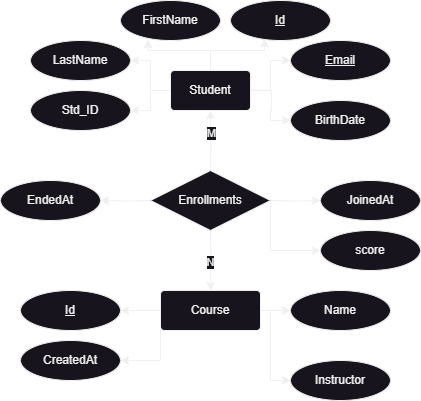

# Student Management System

A simple web api with Asp.Net Core that manages students, courses and also their enrollments.

## ER Diagram

## Resource URI

- **Student**

  - GET /api/students
  - POST /api/students
  - GET /api/students/{{std_id}}
  - PUT /api/students/{{std_id}}
  - DELETE /api/students/{{std_id}}
  - GET /api/students/{{std_id}}/courses
  - GET /api/students/collection/({std_ids})
  - POST /api/students/collection

- **Course**

  - GET /api/courses
  - POST /api/courses
  - GET /api/courses/{{course_id}}
  - PUT /api/courses/{{course_id}}
  - DELETE /api/courses/{{course_id}}
  - GET /api/courses/{{course_id}}/students
  - GET /api/courses/collection/({course_ids})
  - POST /api/courses/collection

- **Enrollments**
  - POST /api/students/{{std_id}}/courses/{{course_id}}
  - DELETE /api/students/{{std_id}}/courses/{{course_id}}
